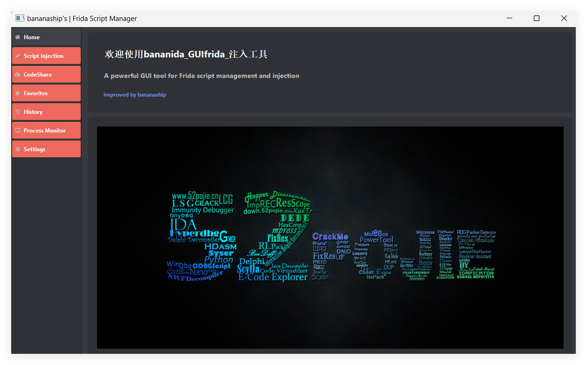

# bananida_GUI

A modern, powerful GUI tool for managing and injecting Frida scripts, **enhanced by bananaship**.

## ✨ Key Features
+ Script Injection: Inject scripts with live preview functionality.
+ CodeShare Integration: Built-in browser and seamless integration with CodeShare.
+ Favorites: Save and manage your favorite scripts.
+ Device Compatibility: Supports Android and iOS devices.
+ Process Management: Easily manage running processes.
+ UI Design: Sleek, modern dark theme interface.
+ Real-Time Monitoring: Monitor processes with live updates.
+ History Tracking: Keep track of scripts and injection history.
+ Automation: Auto-injection support for efficiency.

---

## 📦 Installation

### Prerequisites
- **Python 3.8+**
- **Frida**
- **ADB**(required for Android support)

### Steps
1. Clone the repository:
   ```bash
   git clone https://github.com/bananashipsBBQ/bananida_GUI.git
   cd bananida_GUI
   ```

2. Install dependencies:
   ```bash
   pip install -r requirements.txt
   ```

3. Run the application:
   ```bash
   python src/main.py
   ```
4. Interface display

---

## 📑 Project Structure
```
bananida_GUI/
├── src/
│   ├── gui/
│   │   ├── widgets/
│   │   │   ├── device_panel.py
│   │   │   ├── data_visualizer.py
│   │   │   ├── history_page.py
│   │   │   ├── injection_panel.py
│   │   │   ├── output_panel.py
│   │   │   ├── process_monitor.py
│   │   │   ├── process_panel.py
│   │   │   └── script_editor.py
│   │   └── main_window.py
│   ├── utils/
│   │   └── themes.py
│   └── main.py
├── requirements.txt
└── README.md
```

---

## 🔧 Core Components
### Device Panel
Supports USB and network-connected devices.
Detects Android devices and manages Frida server.
Displays process lists.
### Script Editor
Features syntax-highlighted code editing.
Provides script management and injection options.
Monitors output in real time.
### Process Monitor
Displays a real-time, filterable process list.
Tracks memory usage with auto-refresh.
### Data Visualizer
Visualizes process data with graphs.
Shows memory usage and performance metrics.
Updates in real time.
### History Page
Logs script history and injection details.
Enables quick re-injection of past scripts.
Tracks sessions for easy reference.
---

## 📋 Dependencies
See the requirements.txt file for a full list of required packages.

---

## 👨‍💻 Author
bananaship